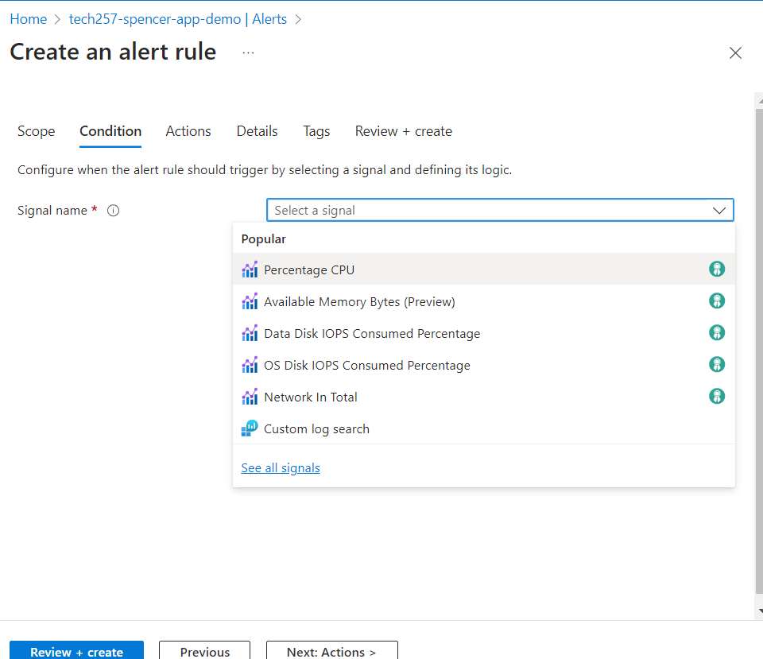
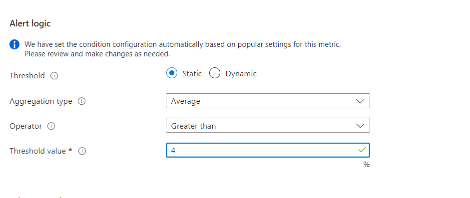
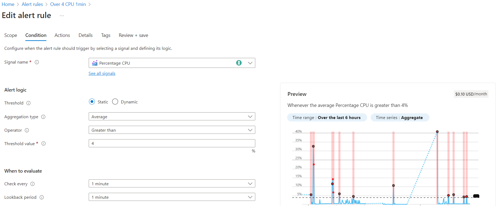
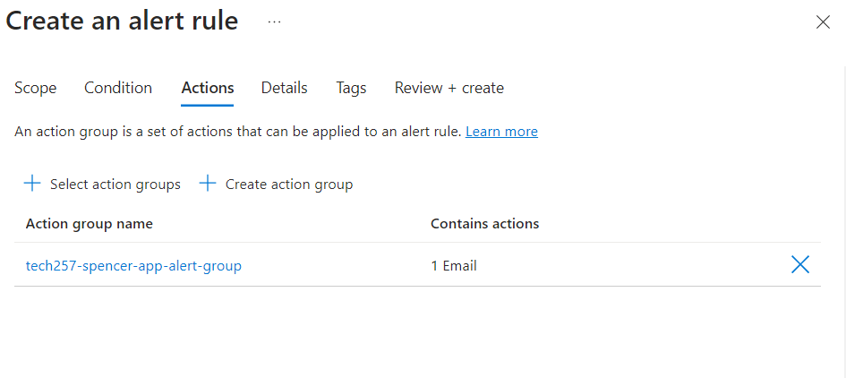
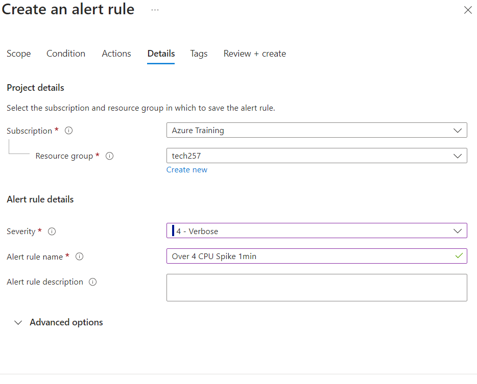
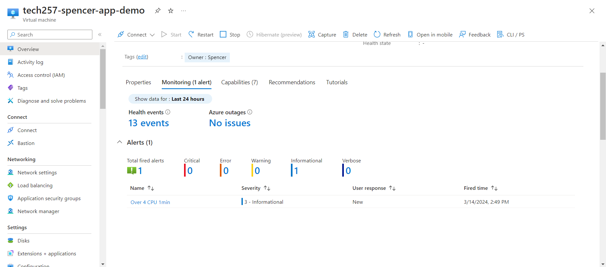
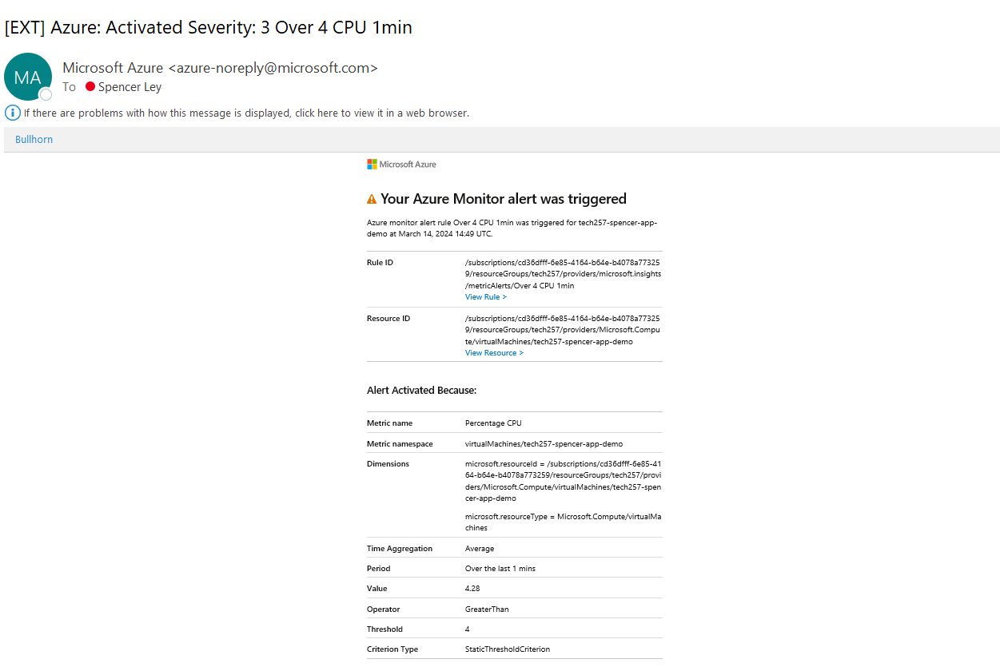

# Alerts on VM exceeeding 4% CPU
- Create the group and set up to email to your account.
  
- Then create the rule on the VM page, 
- Select the signal, in our case Percentage CPU

- Set the alert Logic sit alerts us when cpu is greater than whatever you decide on through load testing (in my case 4%)
    
    
    
- Set the action group:
    
    
- Name and options:
    
    
- Test the alert:

