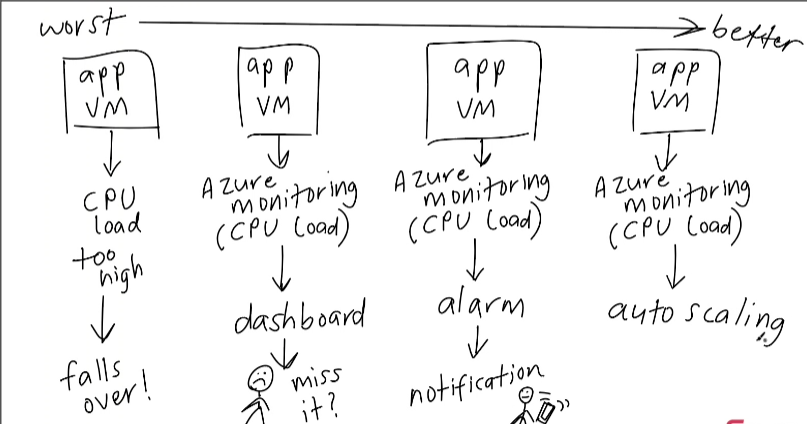
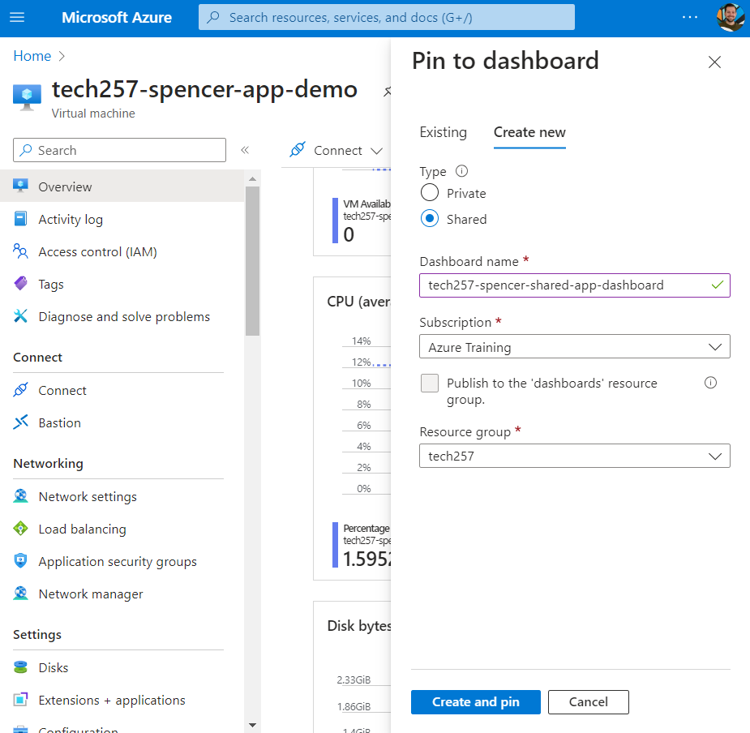
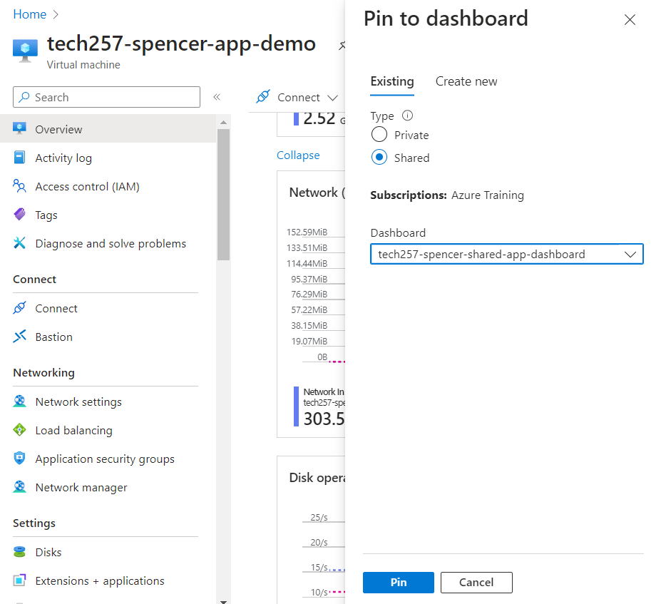
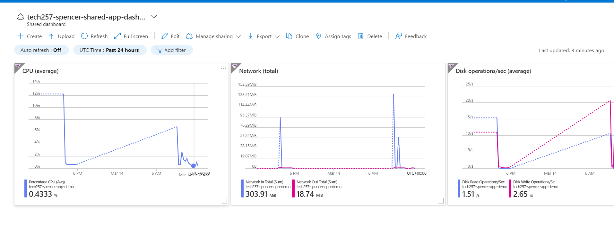
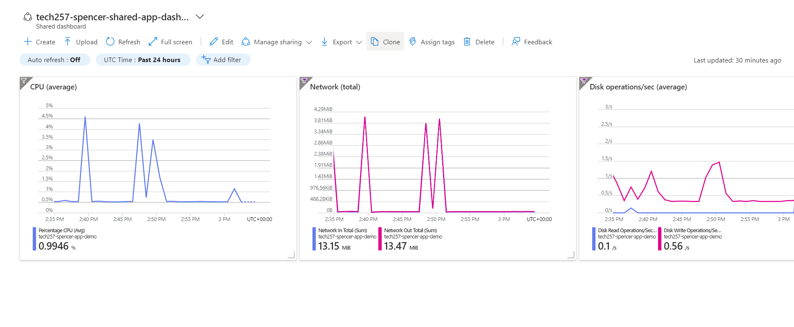

# Auto-Scaling

- The more manually that you have to monitor alerts and handle alerts the worse you're probably doing it

- Dashboard
    
    
    
    
    
# Load Testing

- Command to install Apache Bench for load testing:
    - `sudo apt-get install apache2-utils`
- To load test: runs 1000 requests 100 at a time:
    - Specific:
        - `ab -n 1000 -c 100 http://172.166.171.139/`
    - General:
        - `ab -n 1000 -c 100 http://<app VM's IP address>/`
    - Then we did 10000 200 at a time - timed out at 2444 requests - 5% cpu usage, set an alert for 4% that will notify me.
        
# Alerts on VM exceeeding 4% CPU
- Create the group and set up to email to your account.
  
- Then create the rule on the VM page, 
- Select the signal, in our case Percentage CPU

- Set the alert Logic sit alerts us when cpu is greater than whatever you decide on through load testing (in my case 4%)
    
    
    
- Set the action group:
    
    
- Name and options:
    
    
- Test the alert:

