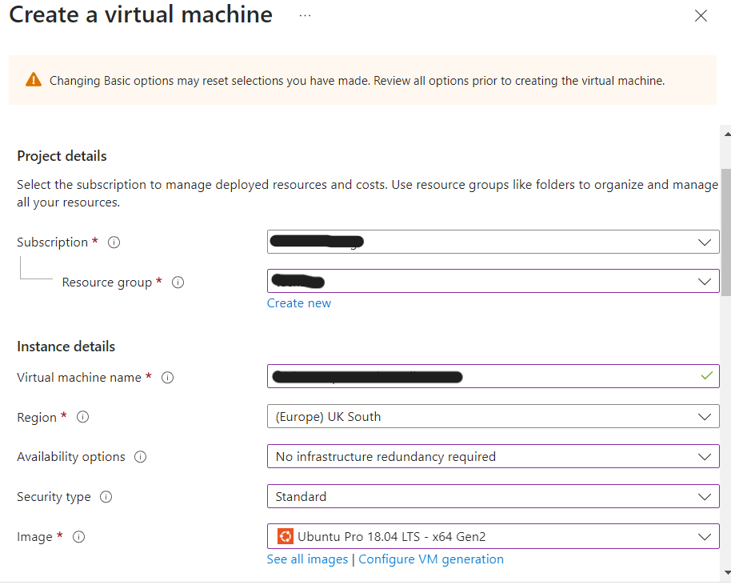
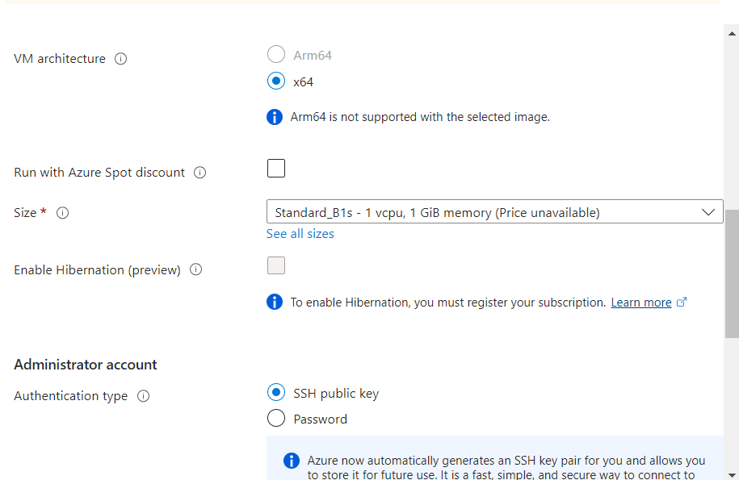
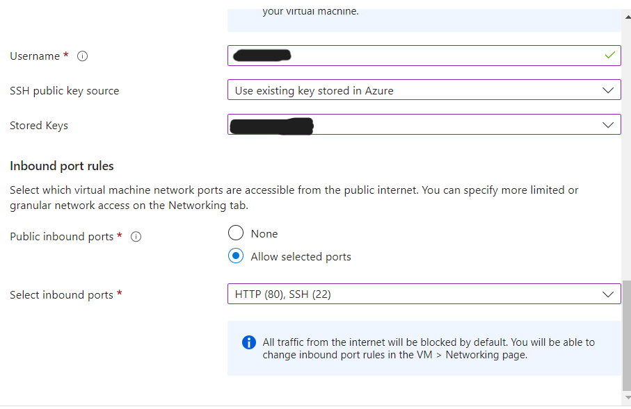
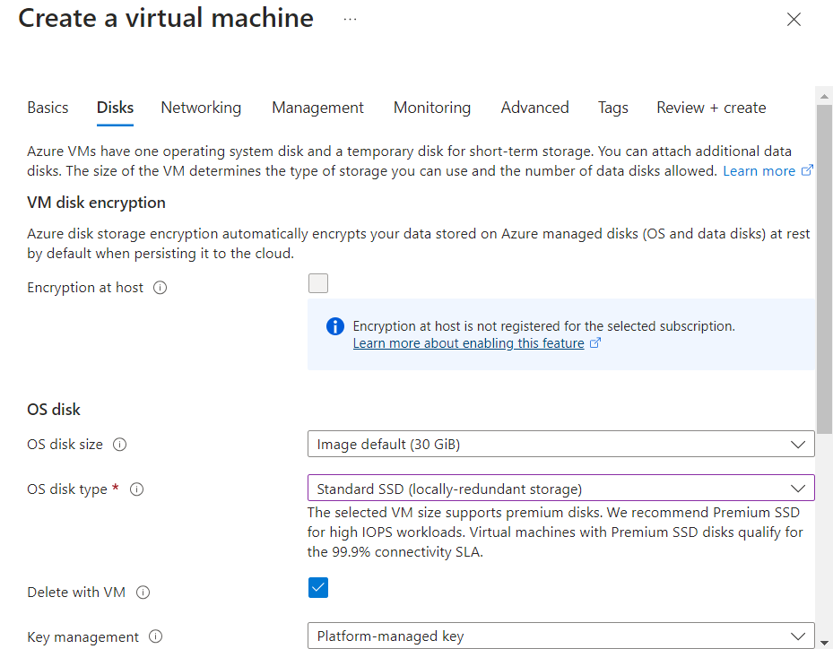
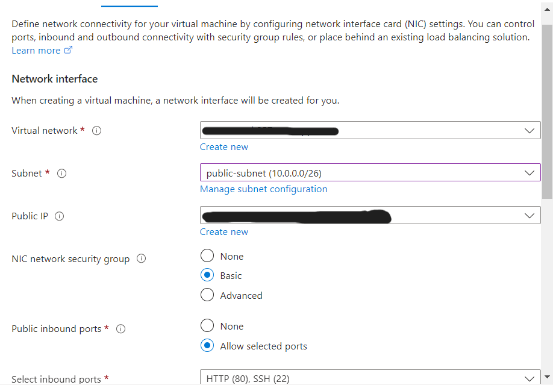
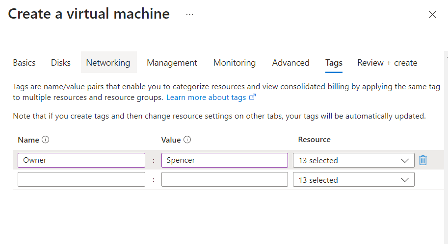
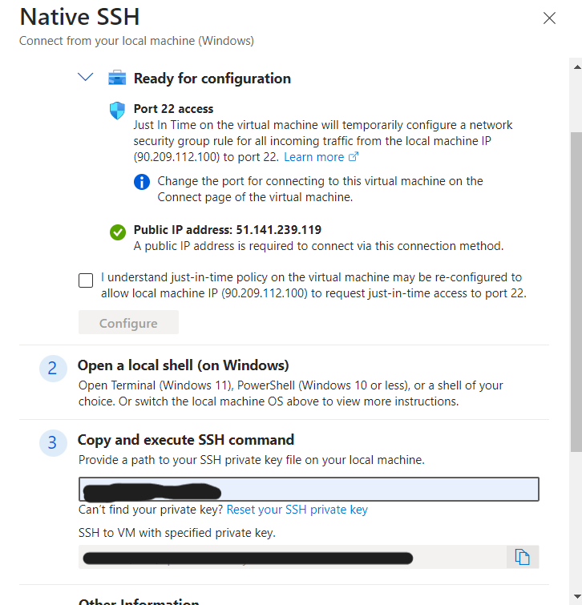

# Azure Virtual Machine

## Virtual machines

### A Virtual Machine (VM) is a software emulation of a physical computer that runs an operating system and applications, just like a physical computer. A hypervisor manages VMs by allocating physical resources (like CPU, memory, and storage) to each VM.

- Components:
    - Virtual CPU (vCPU): Simulated CPU that performs computation tasks for the VM.
    - Virtual Memory: Allocation of physical memory from the host to the VM. 
    - Virtual Disk: A file or set of files that appear as a physical disk drive to the VM. 
    - Virtual Network Interface: Enables the VM to connect to a network as if it were a physical computer. 
    - Isolation: Each VM operates in an isolated environment, unaware of other VMs on the same host, ensuring security and stability.

## How to login to Azure

- Go to portal.azure.com/ and enter your credentials

## Setup SSH key on Azure

1. Set up your ssh keys on your local machine 
2. Go to the Azure site and search for ssh keys 
3. Click create enter the correct subscription and resource group 
4. Name the key 
5. Select upload existing key and paste in the public key 
6. Click review and create 
7. Click Create

## How to create a VM

- Availability Zone - No infratsructure redundancy required
- Security Type - Standard
- Operating system / images - we will be using see all images ubuntu pro 18.04 gen 2
- Size stardard B1S - 1 vcpu, 1GiB memory - instance size: Standard_B1s - 1 vcpu, 1GiB
- username - adminuser
- key stored in azure
- select own key
- inbound ports - SSH and HTTP

- Disk
    - OS disk type - Standard SSD
    - Delete with VM must be ticked
  

- Network
    - Public subnet
    - Delete public IP and NIC when VM is deleted tick this box

- Tags
    - Owner : Spencer

## How to SSH into your VM

- Connect
    - Connect,
    - Connect native ssh,
    - Enter path to private key,
    - Copy command into bash `ssh -i ~/.ssh/<private-key> [<username>@<ip.address>]`,
    - Yes to continue connecting

## How to delete to a VM
- Delete the VM
    - Select everything that is Virtual Machine Type
    - Tick force delete
    - Type delete
    - Delete button x2