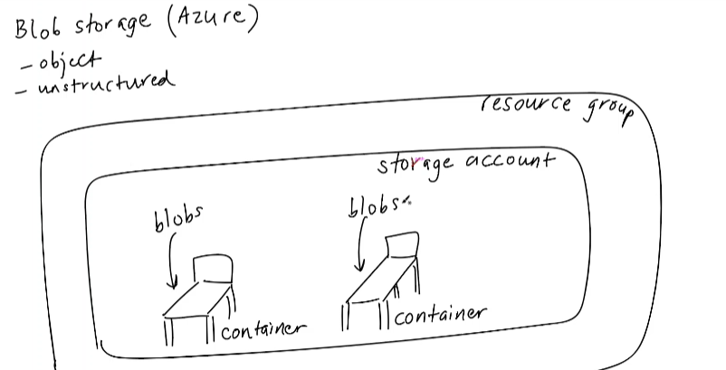
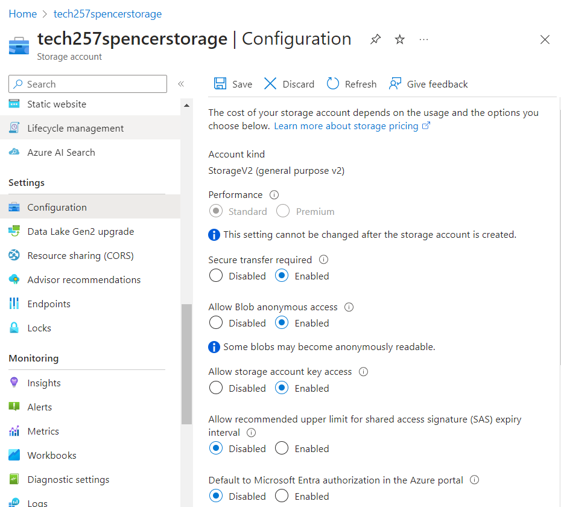
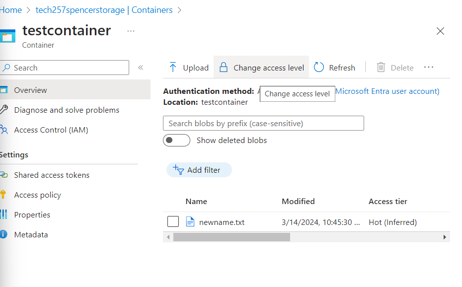
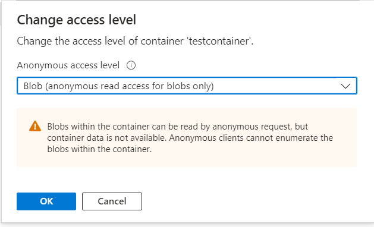

# Blob Storage Codealong

- Can’t put a container inside a container
    - However if you upload a folder with files then it will register that and keep the files withing the folder.
    - Not designed for this though more of a container to just dump info into

    

- Cheapest version of blob storage has redundancies, 3 copies of your data LRS (Local Redundant Storage) within the same datacentre.
- Redundancy built it.
- https://learn.microsoft.com/en-us/cli/azure/install-azure-cli
- Install Azure CLI on VM
    - `curl -sL https://aka.ms/InstallAzureCLIDeb | sudo bash`
- We’ll be making two scripts:
    1. Changing the front page of the app to a new image using blob storage - you’ll have to enable public access due to a new Azure setting. Add a delay to your script so that it actually runs. Public access on storage account and on the container
    2. 
- Create a storage account:
    - Specific:
        - `az storage account create --name tech257spencer-storage --resource-group tech257 --location uksouth --sku Standard_LRS`
    - General:
        - `az storage account create --name <name-of-storage> --resource-group <resource-group> --location uksouth --sku Standard_LRS`
- List storage accounts - Loads of JSON:
    - Specific:
        - `az storage account list --resource-group tech257`
    - General:
        - `az storage account list --resource-group <resource-group>`
- List storage accounts - readable:
    - Specific:
        - `az storage account list --resource-group tech257 --query "[].{Name:name, Location:location, Kind:kind}" --output table`
    - General:
        - `az storage account list --resource-group <resource-group> --query "[].{Name:name, Location:location, Kind:kind}" --output table`
- Create container inside storage account:
    - Specific
        - `az storage container create \
        --account-name tech257spencerstorage \
        --name testcontainer`
    - General:
        - `az storage container create \
        --account-name <storage-name> \
        --name <container-name>`
    - May want to add `--auth-mode login` to avoid the yellow info message
- Deleting our container:
    - Specific:
        - `az storage container delete \
        --account-name tech257spencerstorage \
        --name testcontainer \
        --auth-mode login`
    - General:
        - `az storage container delete \
        --account-name <storage-account> \
        --name <container-name> \
        --auth-mode login`
- listing -
    - Specific:
        - `az storage container list --account-name tech257spencerstorage --auth-mode login`
    - General:
        - `az storage container list --account-name <storage-account> --auth-mode login`
- Listing - User Friendly:
    - Specific:
        - `az storage container list \
        --account-name tech257spencerstorage \
        --output table \
        --auth-mode login`
    - General:
        - `az storage container list \
        --account-name <storage-account> \
        --output table \
        --auth-mode login`
- Blob upload:
    - Specific:
        - `az storage blob upload \
        --account-name tech257spencerstorage \
        --container-name testcontainer \
        --name newname.txt \
        --file test.txt \
        --auth-mode login`
    - General:
        - `az storage blob upload \
        --account-name <storage-account> \
        --container-name <container> \
        --name myFile.txt \
        --file myFile.txt \
        --auth-mode login`
- Blob List:
    - Specific:
        - `az storage blob list \
        --account-name tech257spencerstorage \
        --container-name testcontainer \
        --output table \
        --auth-mode login`
    - General:
        - `az storage blob list \
        --account-name <storage-account> \
        --container-name <container> \
        --output table \
        --auth-mode login`
- Make the Storage account public:
    - 
    
- Make the Container public:
   
   

- 15 second sleep command to make sure the script works consistiently after changing the security of the container and blob