# Database Security

- You can set up a Network Security Group on a subnet and not just on the VM.
- We can specify where traffic is allowed into our database, we can restrict it as much or as little as we like. To specifiv VM IP address or to the subnet for example (most likely want it to be the subnet so any VM’s within the subnet can access the DB).
- Could not have a public IP on the DB which means you’d have to SSH into the app VM then have a jumpbox into the DB VM.
- User Routes: Special routing so we have something inbetween the APP and DB to filter the traffic using a Network Virtual appliance.
- This gives us only one path to get to the DB, has to go through the NVA.
- Has a NSG and NIC as normal and then a DeMilitarised Zone (DMZ) Subnet.
- NVA has a public Ip initially so we can SSH into it for set up only
- Need to create and assign a route table (to-private-subnet-route-table) and associate it with our public subnet. If packets from app match the rules in the route table then it will send them through the NVA and nowhere else. Packets go to the next hop (NVA) (next place they can go), the NVA will then forward the traffic to the DB.
- The forwarded traffic has been filtered by the NVA.
- On the NVA’s NIC we to enable IP forwarding (done on Azure)
- In Linux we also need to tell it that we want to do IP forwarding and tell it that its enabled.
- NVA will forward on everything once both are enabled so we need to create fome rules to decide which ones its forwarding on. Use IP tables rules

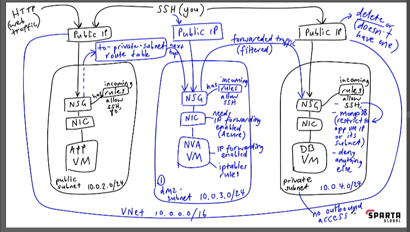

## Set up VNet:
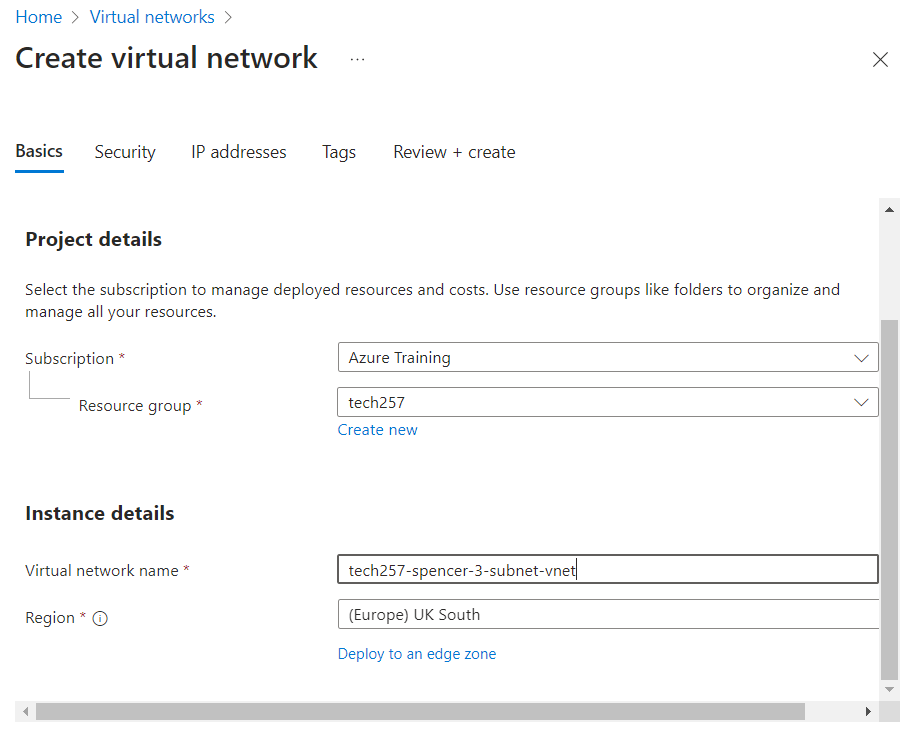
- Security leave alone
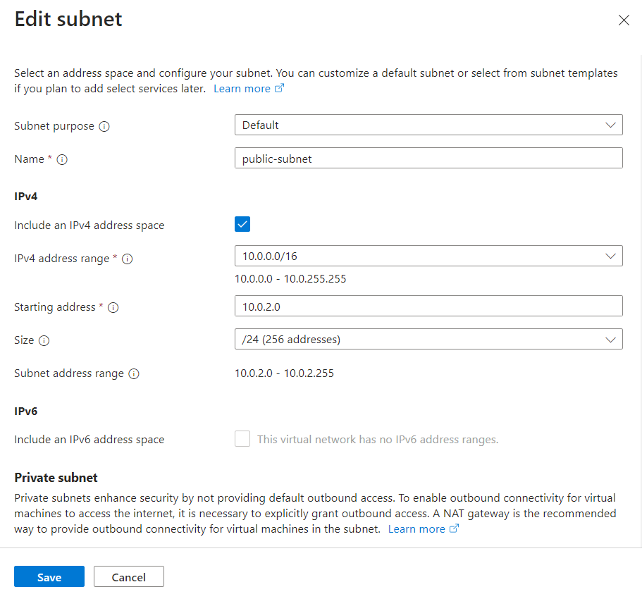
- For public change nothing else
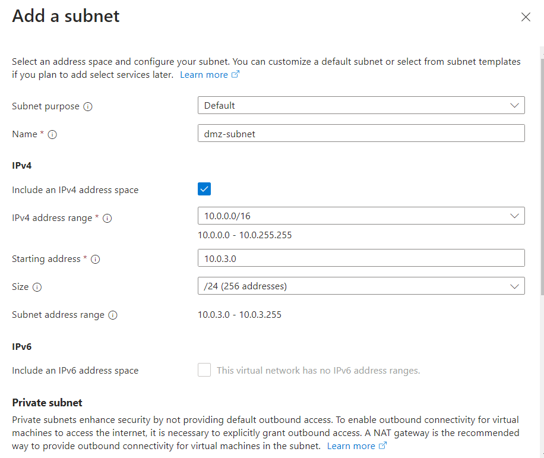
- DMZ change nothing else
- Enable private subnet for the private subnet
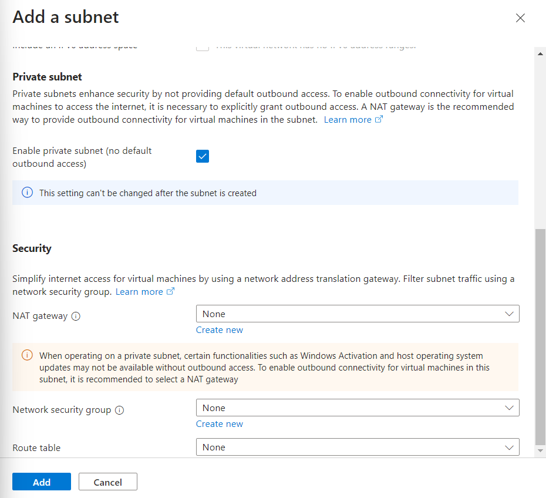

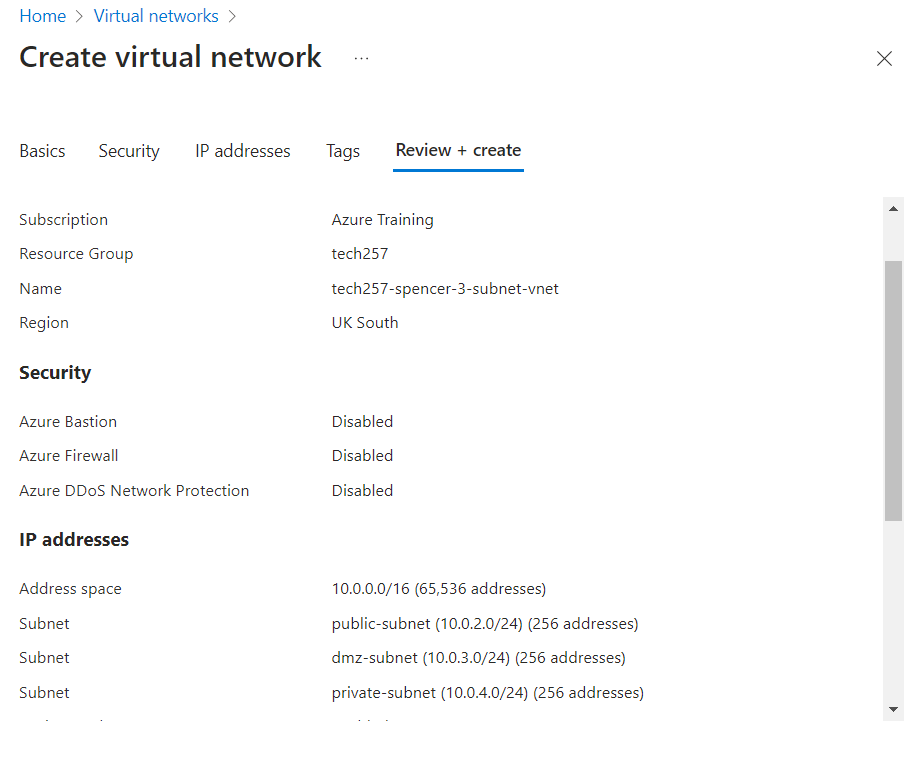

## Database VM:
- Use an image to set up our DB VM with Mongo DB already installed.
- Set up DB VM first as we need the Private IP address for the App to communicate with.
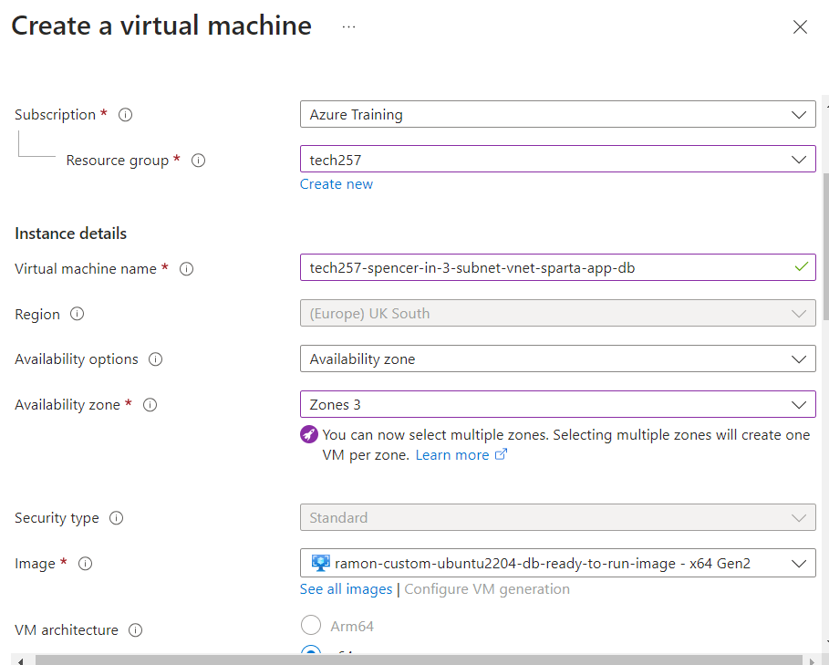
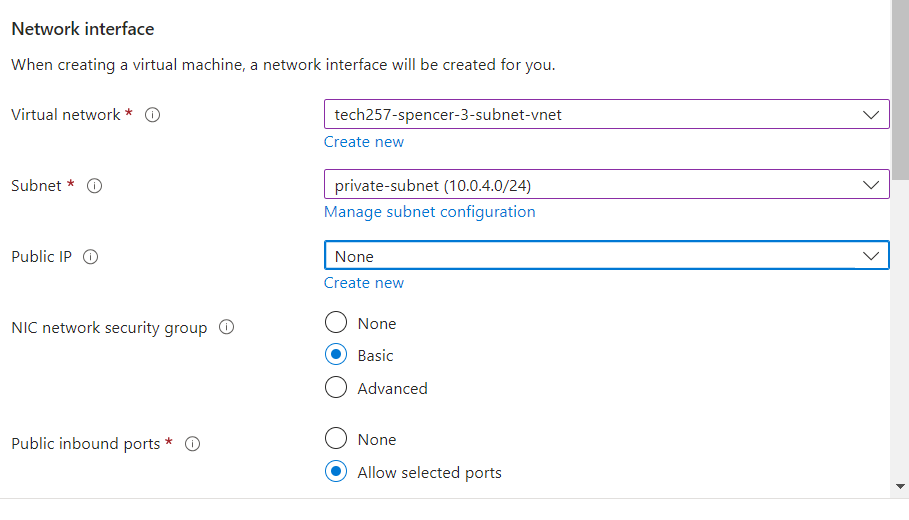
- No public IP for DB VM

## App VM:
- Set up app VM as normal
- Include DB_HOST in user data before cding into the app folder
- Test!

## NVA(Network Virtual Appliance) VM
- Use a clean image to setup
- Just SSH same as DB
- User Data to update and upgrade

## Testing:
- Set up a ping to test connections between app and db.
    - ICMP
    - Doing this for testing, doesn’t have to be set up.
    - IP of db vm
    - `ping <db-ip-address>`

## Create Route Table:
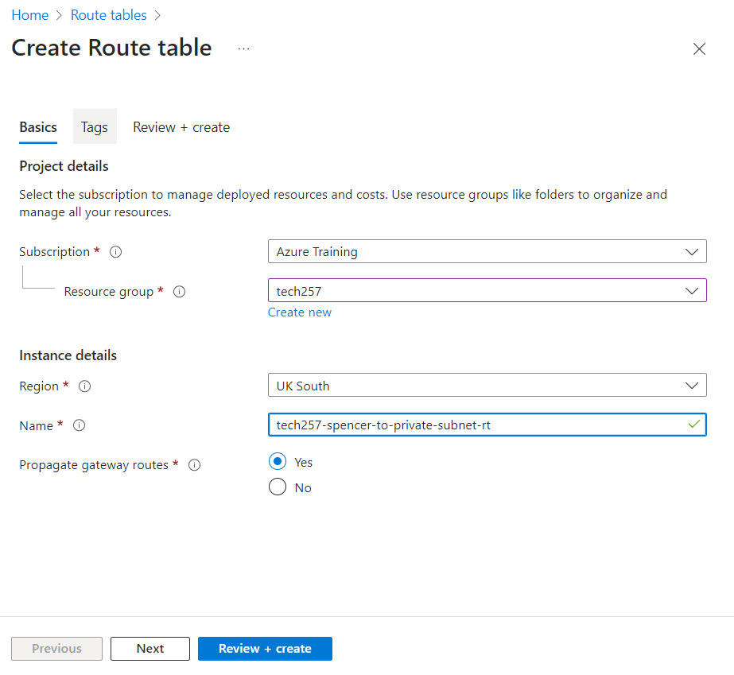
- Add Route:
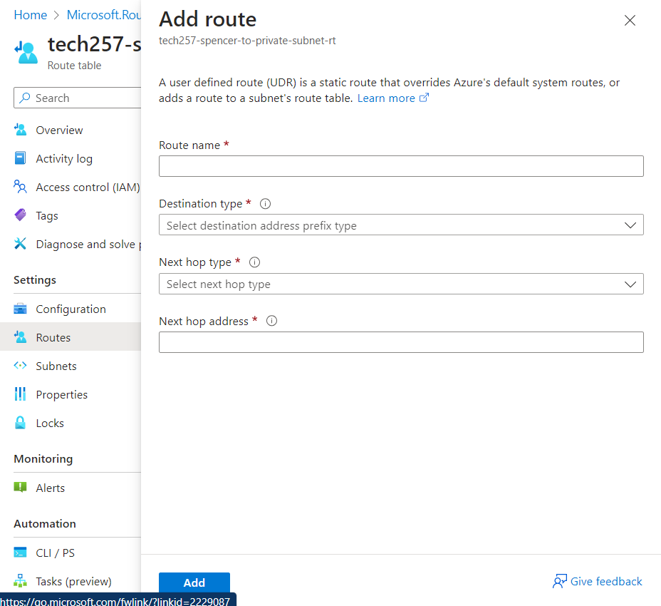
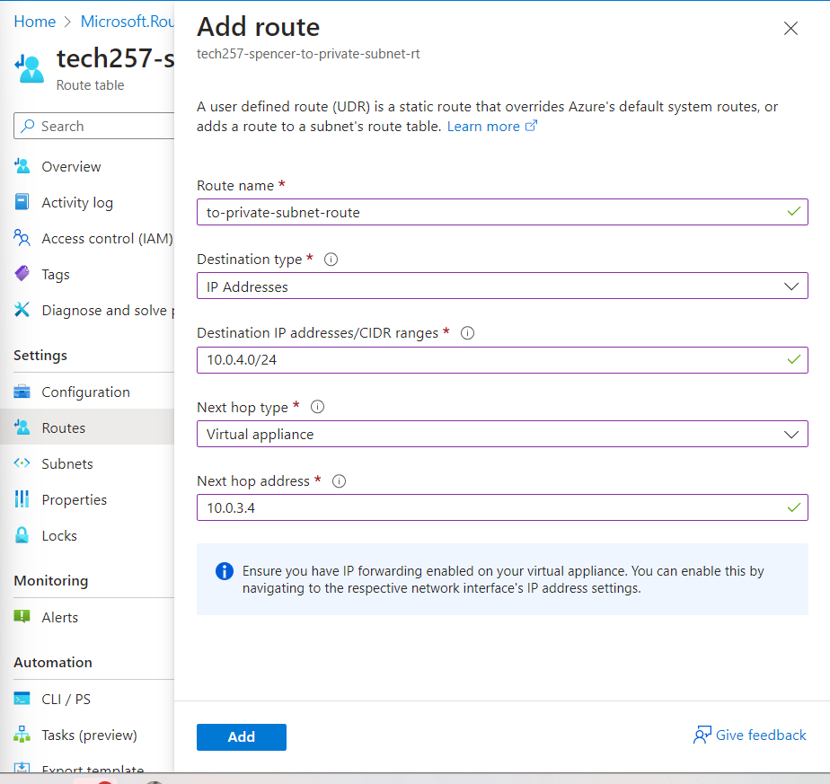
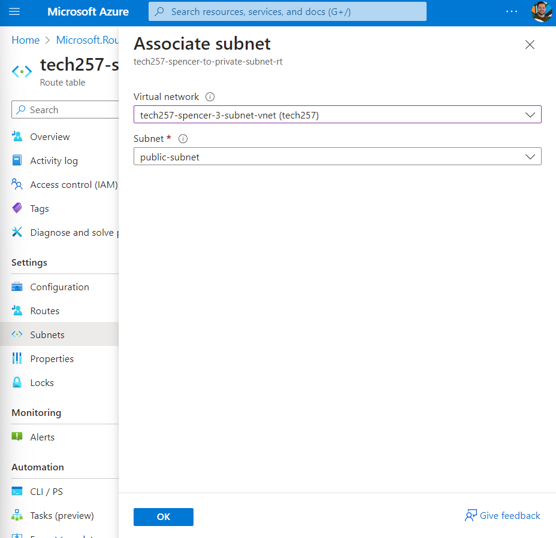
- The ping should stop running once the Route table is set up but the rule isn't created.
- Next set up IP forwarding on NVA
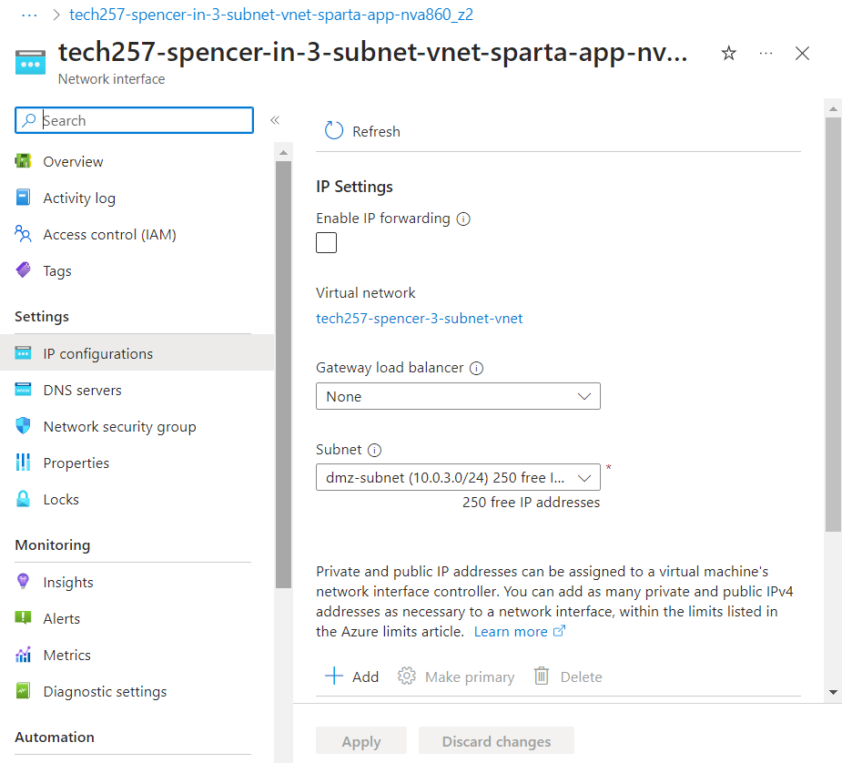
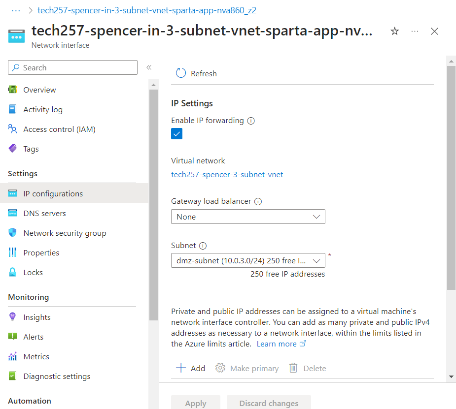
- Set up IP forwarding in Linux:
  - SSH into NVA
  - `sysctl net.ipv4.ip_forward`
  - `sudo nano /etc/sysctl.conf`
  - Uncomment:
    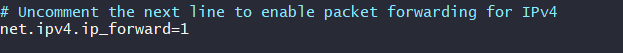
  - `sudo sysctl -p` to restart file
- Now set up the filters only specific traffic allowed through:
    - Run this Script: [Script form Ramon](ip_rules.sh)
    - Controlling the specific route that packets need to take to go from the public subnet to the private subnet.
    - This is the type of architecture that is reccomended to make things more private, in the Microsoft documentation.