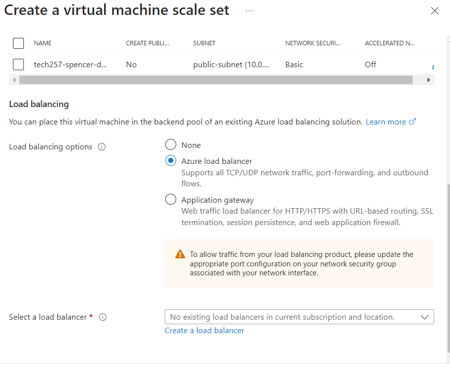
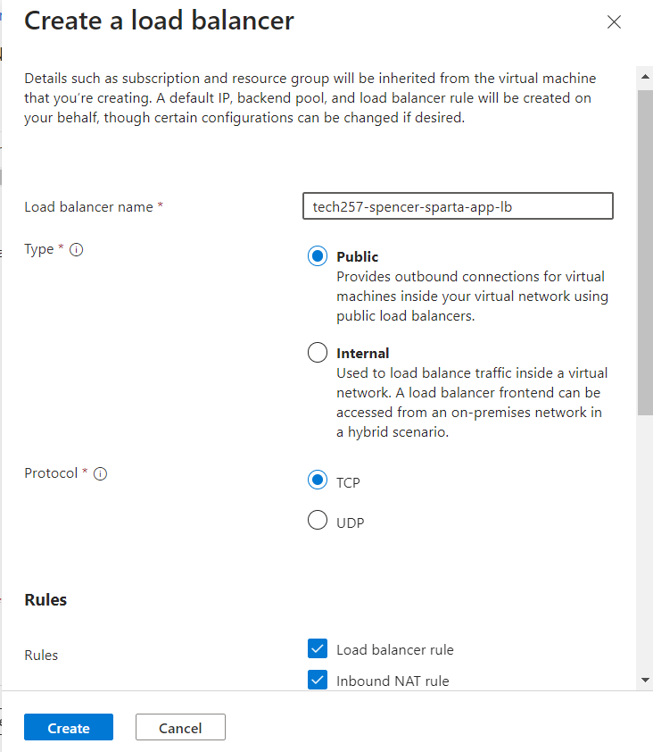
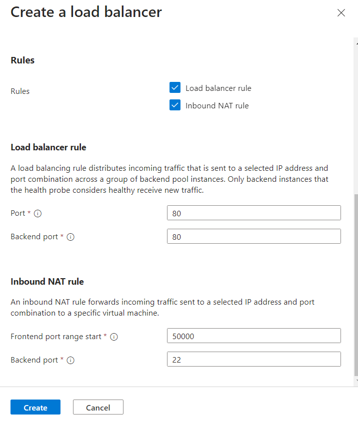
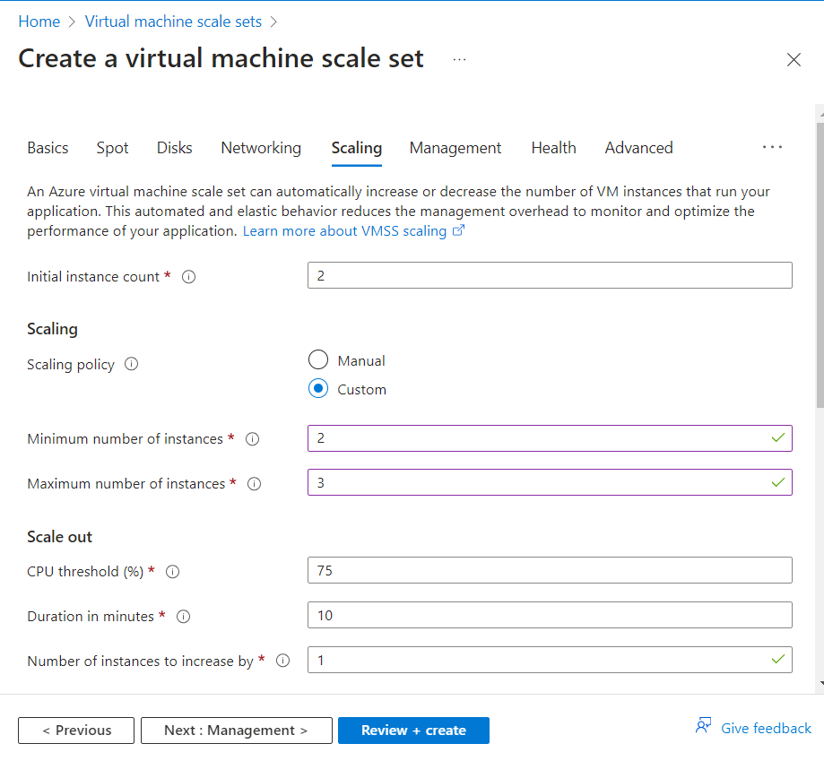
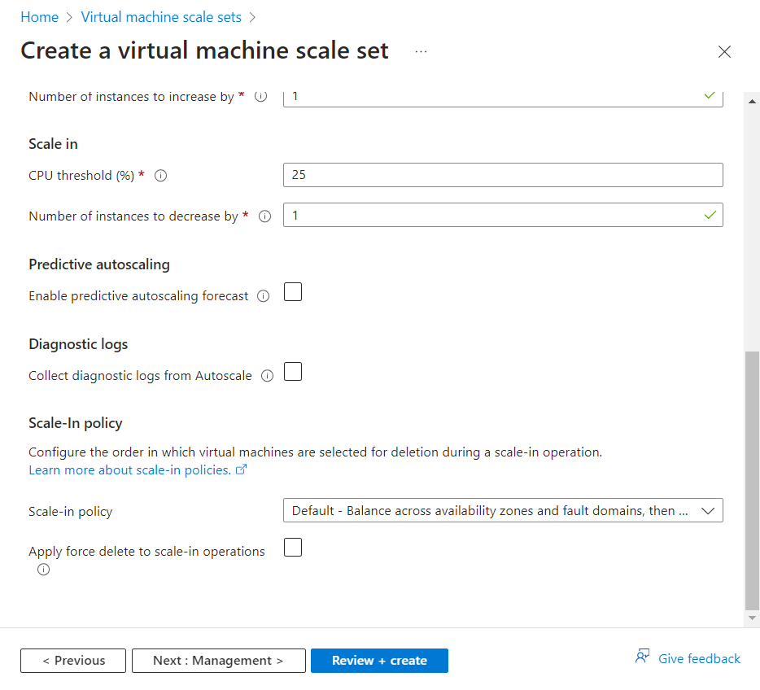

# Setting up a Virtual Machine Scale Set

## Pre-requisites
- Goal to have High Availability and Scalability
- Used to have to give credit to marketplace images when creating an image, now you don’t.
- Create own Custom Image without a VM to create from:
    1. Clean version of Ubuntu (ubunto.com) - compressed but still a big file (Virtual Hard Disk file).
    2. Uncompress it then uncompress it again and end up with 30GB file.
    3. Put this file onto blob storage.
    4. Can then be referenced to create a Custom Image.

## Basics
- Set your subcription and resource group.
- Set the scale set name (something appropriate and helpful).
- To make our set High Availability we want to select three availability zones so that if one area goes down we will have machines in another zone to handle demand.
- We also want a Uniform Orchestration mode as we want indentical instances.
- We will be using our image that we set up earlier
- Set your username and use a stored SSH key
- License type to other.

## Disk
- OS Disk type to Standard to keep the price point lower for what we need it for.

## Networking
- Virtual network: we'll use one we prepared earlier.
- For the interface we will need to edit the public option that comes up to set the inbound ports to allow selected - HTTP and SSH.
- Load Balancing: Azure Load Balancer set to Public, TCP then create. 
- The load balancer is an important part of this as it will handle the traffic to each instance of our VM and handle any increase in traffice including sending a signal to add or remove a maching and handle any health checks.

## Scaling 
- Initial instances 2 so that we always have at least one back up to help support.
- Policy manual: 

## Health
- Enable application health monitoring
- Automatic repair policy: enable and 10 min grace period.

## Advanced
- Enable User Data and add in our script to run the app on each new instance (VM).

## Tags
- Name (Owner) : Value (Name).

## Review and Create
- Carefully review our data to make sure it's all correct.
- Click Create.

## Managing Instances
- In the overview after the creation you can view  and manage your instances, whether thats to start, stop or reimage them.

## To make an unhealthy instance
- Have you tried turning it off an on again?
- Select the instance you want to make unhealthy and click restart.

## To SSH into an instance
- `ssh -i ~/.ssh/spencer-az-key -p 50000 adminuser@4.159.36.189`
- `ssh -i ~/.ssh/spencer-az-key -p <port> adminuser@<loadBalancerIp>`

## How to Delete a VM Scale Set
- To delete - there are 4 things you need to remove, in a specific order and must have the others in place to delete:
    1. Scale Set
    2. Load balancer
    3. Public IP of load balancer
    4. Network Security Group