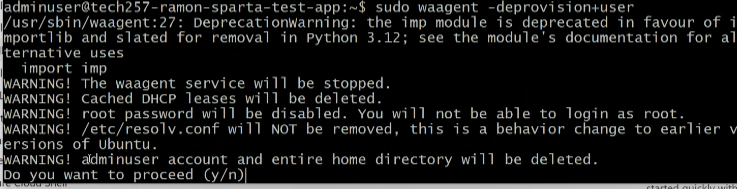
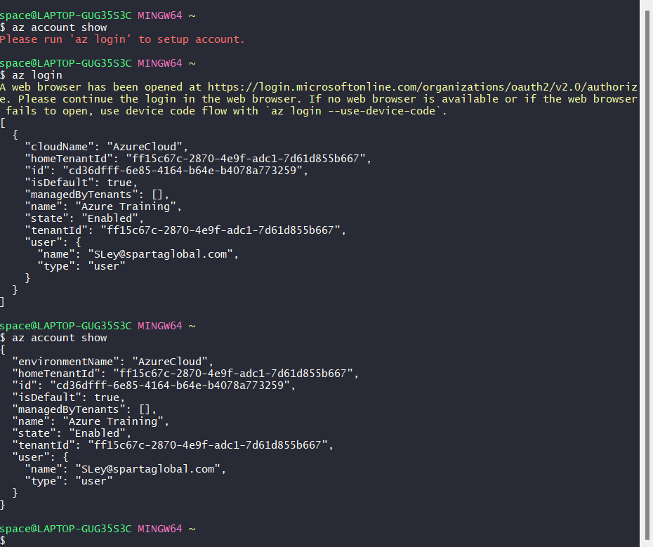
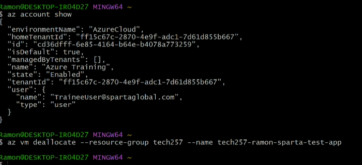
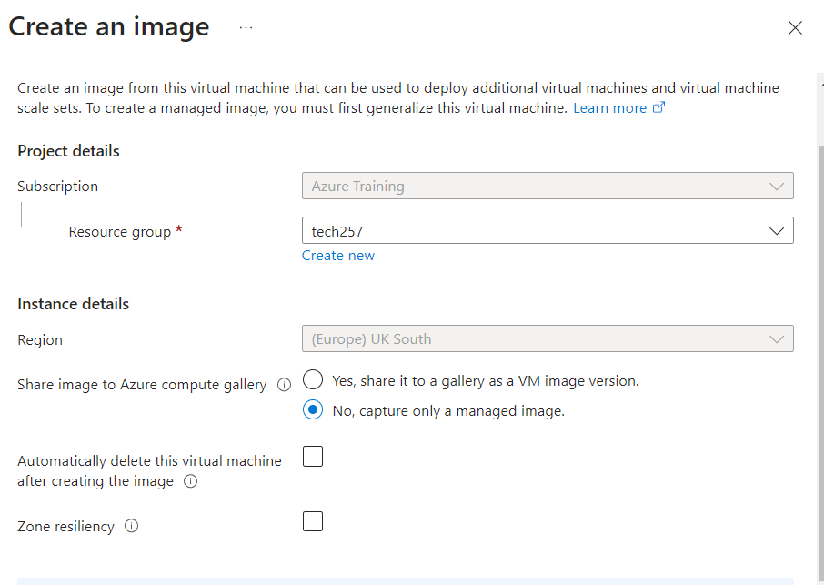
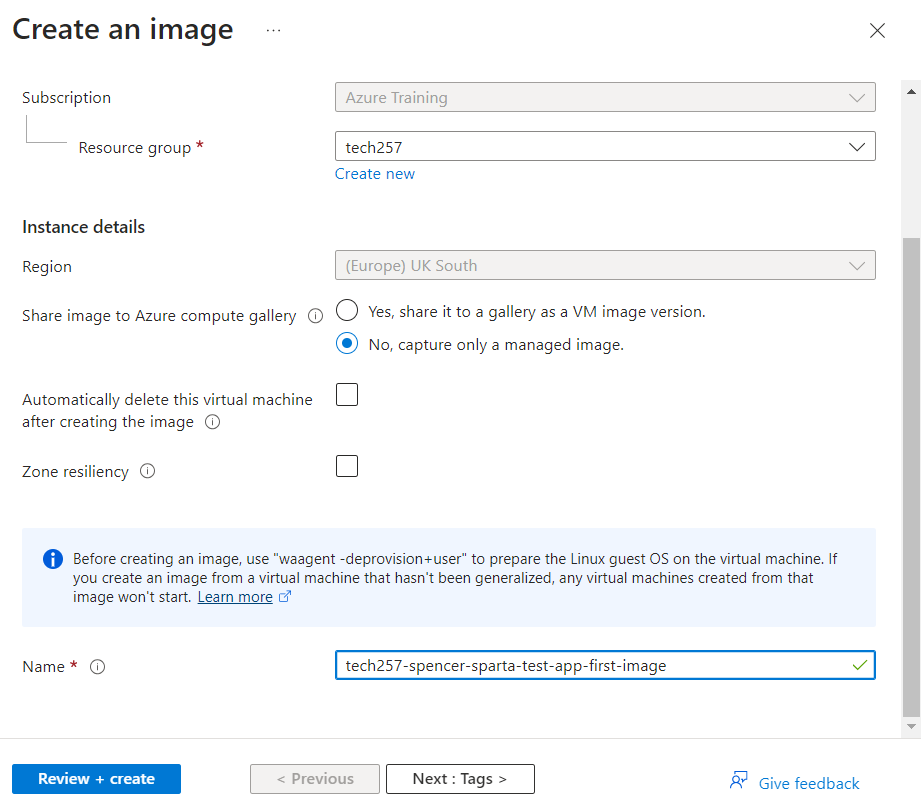
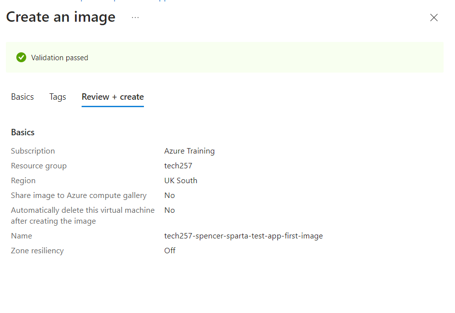
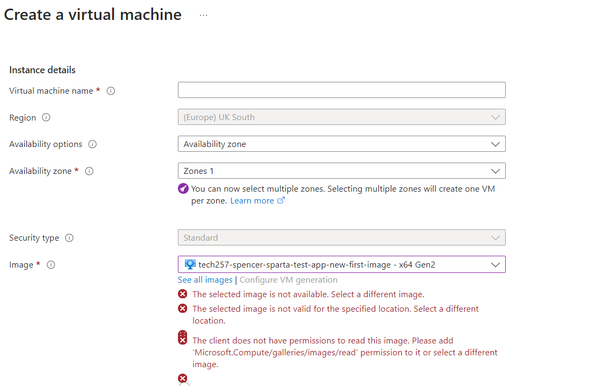

# Create a Virtual Machine from an Image

## Set-up
- Install Azure CLI
- Once Azure CLI should then have az command
    - `az --version`
- `sudo waagent -deprovision+user` - Deprovision machine, getting it ready, gets rid of user data

- `az vm deallocate --resource-group <yourResourceGroup> --name <yourVMName>`
    - For me `az vm deallocate --resource-group tech257 --name tech257-spencer-sparta-test-app-new`

- `az vm generalize --resource-group <yourResourceGroup> --name <yourVMName>` - prep to use as an image, like the ubuntu image
    - `az vm generalize --resource-group tech257 --name tech257-spencer-sparta-test-app-new`

## Create an image

1. Click Capture to create an image 
2. Then select the resource group
3. No capture only a managed image
4. Pick an appropriate name

## Create VM from image

1. Follow the same steps to create a virtual machine except when you select image use your newly created image.

## Once the image has been deleted

- Because the image has been deleted it is no longer available to select as an image for our new virtual machine and so you get the errors: Image not available, image not valid for this location, client does not have permission to read this image.

## User Data
- User data is a script that runs when a VM is first started. 
- This method is used to automate the setup process, including installing software, applying configurations, or running scripts without manual intervention immediately after the VM boots for the first time.
- When we use User Data tjhe script is run before we've ssh'd into the VM which means that the script is executed without interactive feedback.
