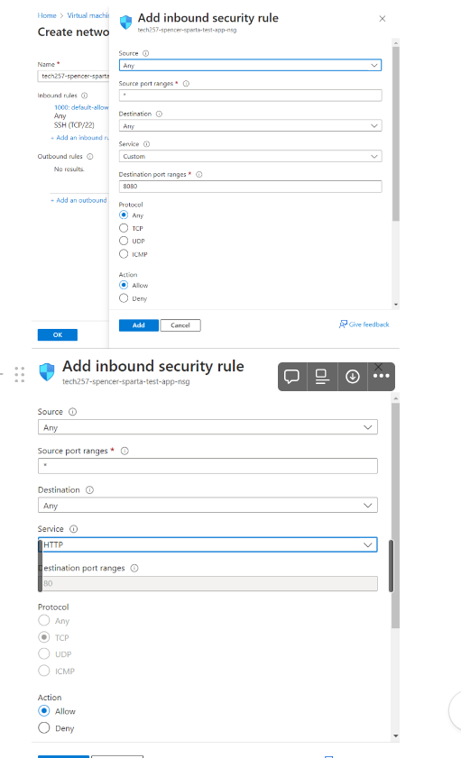

# Virtual Networks

## Deploy App to VM

1. Get the app running
2. Connect to database for post page
- Need ubuntu 24
- had to create a port 3000 for the app to run - create security rule.

## Virtual Networks

- Private vs Public IP addresses
    - have to pay for public IP adresses
    - Certain spaces reserved for private IP addresses
    - Public people can get to it
    - We use private on the inside of our networs so thers can’t access them which is why we need ssh and a public IP
- We are talking about IPv4 rather than the new IPv6
- There’s a lot of space here to assign.

- Needs 32-bits to store, each of the 4 spaces taked up 8 bits

- Range of IP addresses - gives you 256 IP adresses available

## Create Virtual Network
 
 
 
 

