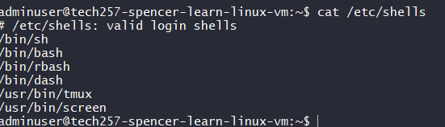
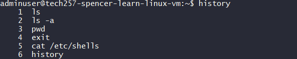
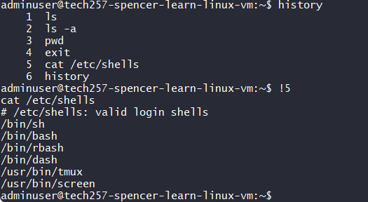
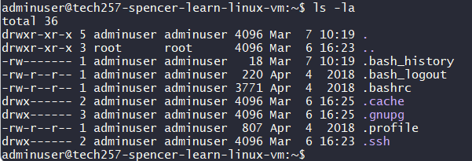

## Linux

What is Linux:

- Clone of Unix which was previously used on main frames and servers.
- Lots of distributions i.e. Ubuntu and RedHat
- Lots of navigating files and folders, making and running scripts, getting server running, env variables etc.
- Starting with / is top of the tree in Linux
- Type exit to exit the Virtual Machine
- bash = Bourne Again SHell
- There other shells available

- To see previously written commands:

- To run a previous command use: `!<number>`

- . is current directory, .. is parent directory
    - They are links to paths
    - To get back to home directory `cd ~` or `cd`

- To see more details of files and folders run  `ls -la`

    
    - '-' at beginning signifies a file a 'd' at the beginning signifies a directory