# Linux

- [Linux](#linux)
  - [What is Linux:](#what-is-linux)
  - [File Extentions](#file-extentions)
  - [Renaming files and Directories pt 2.](#renaming-files-and-directories-pt-2)
  - [Installing a Package](#installing-a-package)
    - [Create new directories and move jokes](#create-new-directories-and-move-jokes)
    - [Different ways to move files:](#different-ways-to-move-files)
  - [Scripting](#scripting)
  - [Environment Variables:](#environment-variables)

 

## What is Linux:

- Clone of Unix which was previously used on main frames and servers.
- Lots of distributions i.e. Ubuntu and RedHat
- Lots of navigating files and folders, making and running scripts, getting server running, env variables etc.
- Starting with / is top of the tree in Linux
- Type exit to exit the Virtual Machine
- bash = Bourne Again SHell
- There other shells available

- To see previously written commands:

- To run a previous command use: `!<number>`

- . is current directory, .. is parent directory
    - They are links to paths
    - To get back to home directory `cd ~` or `cd`

- To see more details of files and folders run  `ls -la`

    
    - '-' at beginning signifies a file a 'd' at the beginning signifies a directory

## File Extentions
- File extentions:
    - curl is used to transfer data and to download files
    - to download  --output <filename>
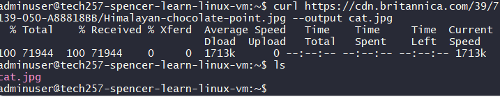
    - To get info on a file - `file <filename>`
    - `cp <filename> <newname>` to copy and create
    - Changing name doesn’t change file type
    - Rename files - `mv <currentfilename> <newfilename>` 
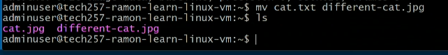
    - Remove files `rm <filetoremove>`
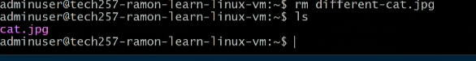

## Renaming files and Directories pt 2.
- Is Linux case sensitive? Yes!
- Make new directory: `mkdir <filename>` no spacing in directory names or it will make multiple directories where the spaces are
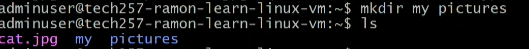

- `mkdir "my pictures"`
- cd into it - can escape a space with `\`
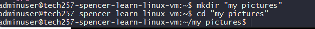

- To remove directories
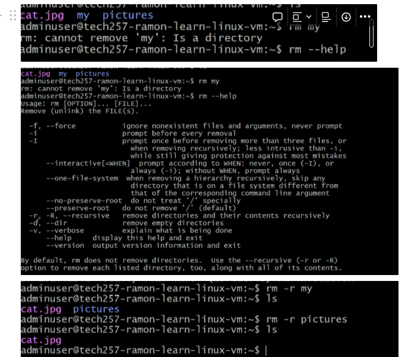
- Make an empty file `touch <filename>`
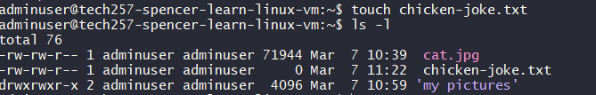
- To edit the file `nano <filename>`
  - enter text
  - ctrl s to save
  - ctrl x to exit
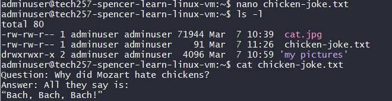
- To get first 2 lines use `head -2 <filename>`
- To get bottom 2 lines use `tail -2 <filename>`
- Get line numbers with `nl <filename>`
- To pipe from one command to the next `|`
    - i.e. `cat <filename> | grep chicken`
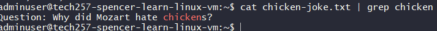

## Installing a Package
- tree:
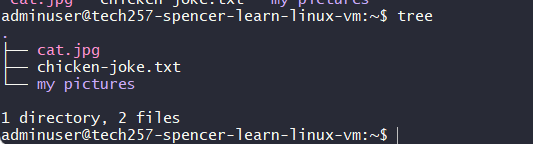
    - to install `sudo apt install tree`
- If you don’t use `sudo` it doesn’t know you’re root (or superuser)
    - superuser do
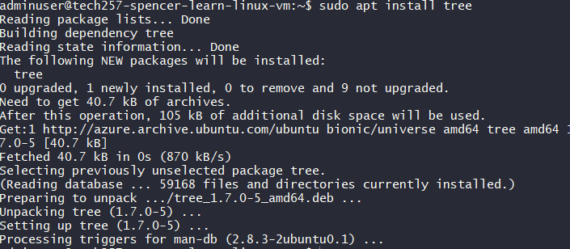
- To get up to date list of available packages `sudo apt update -y`
    - Never run upgrade `apt list --upgradeable` in a dev environment without checking and testing.
    - To upgrade: `sudo apt upgrade -y`
    - It might still ask you questions when you upgrade.
    - If you need to acces a file or folder that you don’t normally have access to you have to login temporarily login as the root user: `sudo su`
    - to get back to admin cd back to main and then `exit`
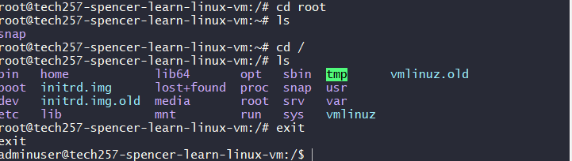
- Linux thinks of everything as files so be careful with error messages saying file.
  
### Create new directories and move jokes
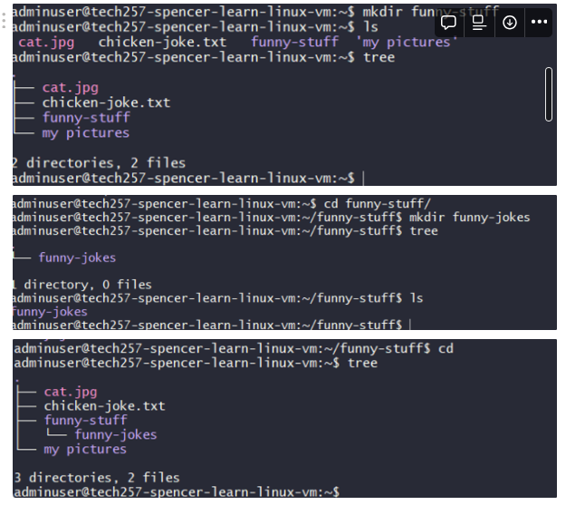
- To move a file `mv <filename> <foldername>`
- To move it back without changing directory `mv <filepath> .`
- To move it from current into a dir within a dir `mv <filename> <dir>/<dir>`
- Rename file within folder `mv <filepath to file> <filepath to file with new name>`
- Move file up one dir: `mv <filepath> <newfilepath>`
- Move file up one dir while within the directory of the file: `mv <filename> ..` 

### Different ways to move files:
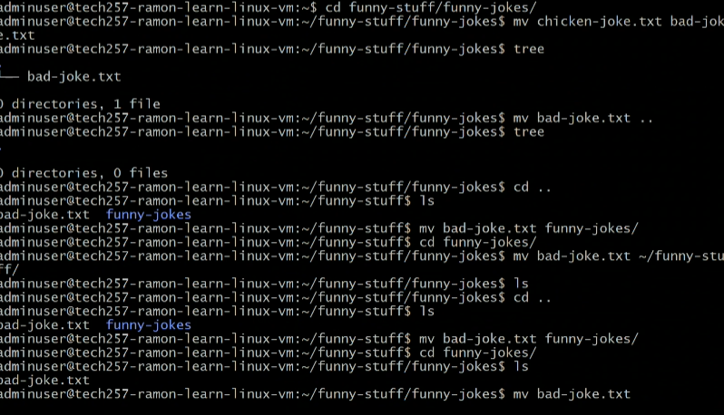
- / double tab to get:
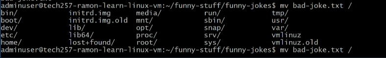
- Find the folder then tab to get the next set
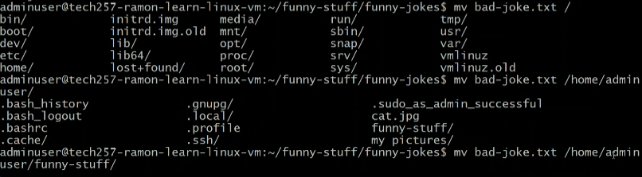
- Backup bad joke to home directory (back-up can just mean move the folder / file)
    - Practice copying files to new locations.
    - `mv <filename> ..`
    - `cd <back to home dir>`
- Remove funny-stuff folder
    - `rm -r <dir>`
    - Always be careful because it may not check with you!
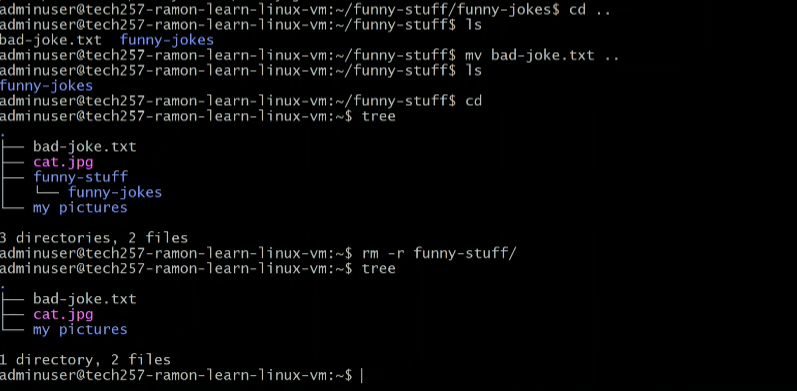

## Scripting
- Like python these run from top to bottom
- Important to think things through
- Going to plan in one window, going to start a webserver nginx
- Create a shell file - `touch prov-nginx.sh`
- nano into it `nano <filename>`
- To make it bash: `#!/bin/bash`
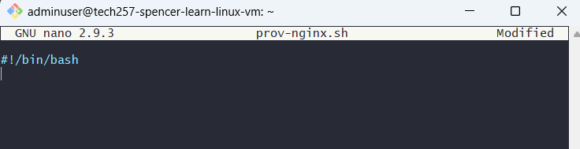
- Install nginx with `sudo apt **install** -y nginx`
- When using system processes use `systemctl`
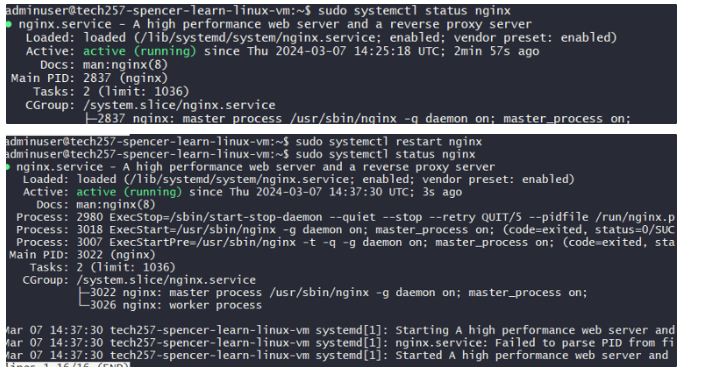
- `sudo systemctl is-enabled nginx`
- Advancing our script:
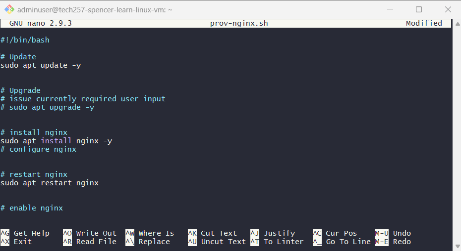
- To run the script you have to provide the full path `./prov-nginx.sh` - this has a permissions issue… see below:
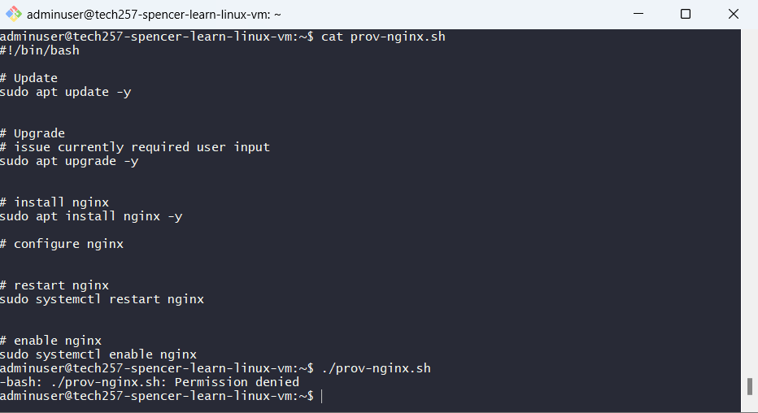
- In order to run the shell script you’re missing the execute permission so we need to add an execute permission:
    - `chmod +x prov-nginx.sh`
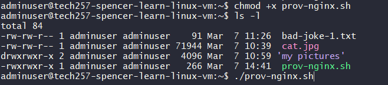

## Environment Variables:
- To print all env vars: `printenv`
- To print specific: `printenv <KEY>`
- echo used to print to screen
- To create a variable `MYNAME=spencer` this will create a variable local to our script can then use them later using a `$`
- To create and environment variable: `export MYNAME=spencer`
  - If you exit then log in it won’t be there, it’s not persistent… yet
- We’re going to modify a config file (.bashrc) so that everytime we spin up the VM it will load / create the env file
    - `nano .bashrc`
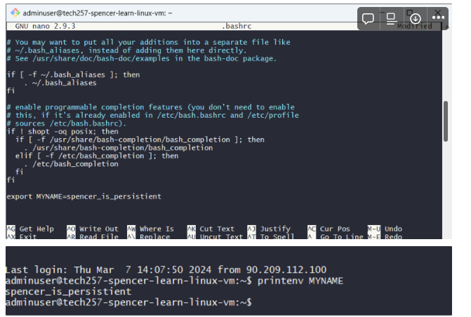
- To get it to work in current session without exiting:
- `source .bashrc`
- **Never hardcode credentials**
- Store them as environment variables