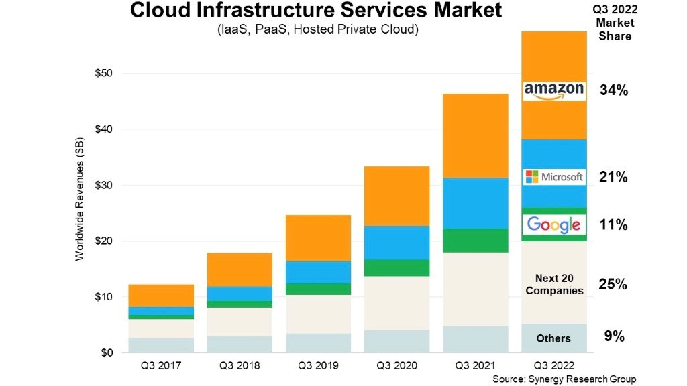

# What is Cloud?

## What is Cloud Computing?
Imagine a vast network of interconnected servers and storage facilities spread across the globe. 
This network, often visualized as a "cloud," provides on-demand access to various computing resources like servers, storage, databases, software, and more, all delivered over the internet. 
Instead of managing your own physical infrastructure, you simply rent these resources from cloud providers like Amazon Web Services (AWS), Microsoft Azure, or Google Cloud Platform (GCP).

## Quick history/timeline of Cloud Computing.
- 1960s: Mainframe computing emerges, with centralized and expensive systems accessible to multiple users through terminals.
- 1970s: Virtualization technology paves the way for dividing a single physical server into multiple virtual machines, increasing efficiency.
- 1990s: The internet and application service providers (ASPs) gain traction, offering software as a service (SaaS) models.
- 2000s: Cloud computing as we know it takes shape, with the rise of on-demand, pay-as-you-go services like AWS and Azure.
- 2010s: Cloud adoption accelerates, with businesses of all sizes migrating to the cloud for its flexibility, scalability, and cost-effectiveness.
- Present: Cloud computing is the dominant computing paradigm, with continuous innovation in areas like artificial intelligence, machine learning, and serverless computing.

## What can you do with Cloud Computing?
The possibilities with cloud computing are virtually endless, but here are some common use cases:

- Run applications: Deploy and manage web applications, mobile apps, or enterprise software without managing your own infrastructure.
- Store data: Securely store and access large amounts of data, ensuring data protection and scalability.
- Build and deploy software: Develop, test, and deploy software faster and more efficiently using cloud-based tools and environments.
- Analyze data: Leverage cloud-based analytics tools to gain insights from your data and make better business decisions.
- Collaborate: Facilitate teamwork and communication with cloud-based tools for document sharing, project management, and video conferencing.
- Backup and disaster recovery: Protect your data and systems from unexpected outages or disasters using cloud-based backup and recovery solutions.
- Host websites: Host your website on the cloud, ensuring high availability, scalability, and performance.

## What are the 4 TYPES/MODELS of Cloud?
- Public Cloud: Shared resources among multiple users, typically the most cost-effective option, with providers like AWS, Azure, and GCP.
- Private Cloud: Dedicated infrastructure for a single organization, offering greater control and security, but often at a higher cost.
- Hybrid Cloud: A combination of public and private cloud environments, providing flexibility and control tailored to specific needs.
- Multi-Cloud: Utilizing multiple public or private cloud services from different providers for redundancy, flexibility, and potentially better pricing.

## What are the different types of cloud SERVICE?
There are three main categories of cloud services, each offering different levels of control and management:

- Infrastructure as a Service (IaaS): Rent virtual servers, storage, networking, and other fundamental computing resources.
- Platform as a Service (PaaS): Access a complete development and deployment environment, including operating systems, middleware, and development tools.
- Software as a Service (SaaS): Use web-based applications like email, CRM, or office productivity tools hosted by the cloud provider.

## Advantages/Disadvantages of the Cloud? Specifically for a business.
### Advantages:

- Cost-effectiveness: Pay-as-you-go model eliminates upfront hardware and software costs, reducing IT expenses.
- Scalability: Easily scale resources up or down to meet changing business demands.
- Increased efficiency: Focus on core business activities while the cloud provider manages the infrastructure.
- Improved collaboration: Access applications and data from anywhere with an internet connection.
- Disaster recovery: Cloud-based backup and disaster recovery solutions ensure business continuity.

### Disadvantages:

- Vendor lock-in: Dependence on a specific cloud provider may make it difficult to switch later.
- Security concerns: Data security is the responsibility of both the cloud provider and the business.
- Potential for downtime: Disruptions in the internet connection or cloud provider's infrastructure can affect service availability.

## What is OpEx vs CapEx?
- OpEx (Operating Expenditure) and CapEx (Capital Expenditure) are two key terms in financial management, particularly relevant to understanding cloud computing's impact on business costs.

### OpEx: These are ongoing costs associated with the day-to-day operations of running and maintaining IT infrastructure. 
- Examples include:
  - Cloud service fees (compute, storage, software)
  - Salaries for IT staff 
  - Internet connectivity costs 
  - Electricity for on-premises data centers

### CapEx: These are upfront costs associated with acquiring and deploying IT hardware and software. 
- Examples include:
  - Purchasing servers, storage, and networking equipment
  - Software licenses (perpetual licenses)
  - Building or upgrading data centers

### Cloud computing generally shifts costs from CapEx to OpEx. Instead of investing in upfront hardware and software, businesses pay for cloud services as they use them. 
- This can result in:
  - Reduced upfront costs: Businesses don't need large capital investments in IT infrastructure.
  - Improved cash flow: Pay-as-you-go cloud model avoids large upfront expenditures.
  - Increased flexibility: Businesses can easily scale their cloud resources up or down to meet changing needs, avoiding being locked into fixed hardware capacity.
  - However, it's crucial to remember that cloud services also incur ongoing OpEx costs in the form of subscription fees or usage-based charges. It's essential to carefully evaluate both OpEx and CapEx when making decisions about cloud adoption to ensure it aligns with your business's budget and long-term goals.

## Marketshare - What is the breakdown?
- Amazon Web Services (AWS): The dominant player with a market share of approximately 32%, known for its breadth of services, reliability, and mature offerings.
- Microsoft Azure: Holding a share of around 22%, popular for its strong integration with Microsoft products and hybrid cloud capabilities.
- Google Cloud Platform (GCP): Capturing about 11% of the market, recognized for its AI and machine learning expertise, competitive pricing, and focus on open-source technologies.
- Other providers: Alibaba Cloud, IBM Cloud, and others share the remaining market share, catering to specific regional or niche needs.

## What are the 3 largest Cloud providers known for?
1. AWS:
   - Offers the most extensive range of services, attracting diverse customers.
   - Known for its high reliability and mature service offerings.
   - Businesses can find almost any service they need for their cloud journey from basic to advanced.
   - Can be complex for beginners due to its vastness.

2. Azure:
   - Tightly integrated with Microsoft products, streamlining migration for existing users.
   - Strong capabilities in hybrid cloud environments, ideal for businesses with on-premises infrastructure.
   - Migration made easy for those that already work within the Microsoft ecosystem.
   - May not be the most cost-effective option for all needs.

3. GCP:
   - Competitive pricing, attracting cost-conscious businesses.
   - Leading expertise in AI and machine learning, ideal for data-driven organizations.
   - Cost-efficient without compromising on quality.
   - Great for data driven orgs deeking AI and ML capabilities.
   - Smaller service portfolio compared to AWS and Azure.

## What are the 4 pillars of DevOps? How do they link into the Cloud?
1. Develop: Cloud-based development tools and platforms enable faster development cycles and easier collaboration. 
2. Operate: Cloud infrastructure provides automated provisioning, deployment, and maintenance, minimizing operational overhead. 
3. Test: Cloud environments facilitate automated testing and continuous integration/continuous delivery (CI/CD) pipelines, improving software quality. 
4. Monitor: Cloud-based monitoring tools provide real-time insights into application performance and infrastructure health, ensuring optimal operation.

## Find up to 3 case studies showing how businesses have migrated to the cloud or used the cloud to improve in some way
1. Netflix: Migrated its entire infrastructure to AWS, achieving greater scalability, flexibility, and cost savings, allowing them to focus on core streaming services.
2. Dropbox: Leveraged AWS to scale its storage capacity and handle massive data volumes efficiently, ensuring seamless user experience for its file-sharing platform.
3. JPMorgan Chase: Adopted a hybrid cloud strategy using both its own data centers and Azure, enabling agility in launching new financial services and complying with stringent regulations.

## How does Cloud Computing work as a business model?
- Cloud providers operate on a pay-as-you-go model. 
- They invest in building and maintaining vast data centers and infrastructure. 
- Businesses then pay for the specific resources they use, such as compute power, storage, bandwidth, and software services. 
- This model reduces upfront costs for businesses while generating revenue for cloud providers through usage fees.

## What sorts of things do you usually need to pay for when using the cloud?
- Virtual machine (VM) hours: You pay for the number of hours a VM is running. 
- Storage: You pay for the amount of data you store in the cloud. 
- Data transfer: You may pay for the amount of data transferred in and out of the cloud. 
- Software licenses: You pay for the subscription fees of cloud-based software services. 
- Remember, cloud pricing models can vary based on the provider, service type, and usage patterns. 
- It's essential to carefully review pricing structures before committing to a cloud service.

## Additional notes
Is it Cloud? Is it:

- Also Multi vs Hybrid Cloud:
    - **Hybrid Cloud:**
        - **Combines:** **Public and private clouds.** This means it integrates an organization's on-premises infrastructure (private cloud) with resources from a public cloud provider like AWS, Azure, or GCP.
        - **Management:** Hybrid clouds usually **act as a single entity**, even though they use different infrastructure. This typically involves specialized tools and expertise to manage the entire ecosystem effectively.
        - **Use cases:** Ideal for organizations with **sensitive data or specific compliance requirements** that need to be kept on-premises while leveraging the scalability and cost-effectiveness of the public cloud for other workloads.
    - **Multi-Cloud:**
        - **Combines:** **Multiple public clouds** from different vendors (e.g., AWS, Azure, GCP). An organization can choose different providers based on specific needs and pricing structures.
        - **Management:** Each individual cloud environment in a multi-cloud setup is typically **managed separately**. This requires diverse skillsets and strategies to manage different cloud platforms effectively.
        - **Use cases:** Ideal for organizations seeking **greater flexibility, vendor lock-in avoidance, or best-in-breed services** from different providers. It also allows for taking advantage of specific features or pricing offered by individual vendors.

- The more a vendor manages the less control you have.

Can get predictions of costs over 2 years from Azure (have to input a lot of data to get though):

- Redundancy in Cloud:
    - Having back-ups of things for disaster recovery.
    - Build back-up based on levels of importance and levels of impact on the business - Live website for example or service being paid for, every secod it goes down you’re losing money and reputation.
- SLA:
    - Guaranteed level of service and if it doen’t reach this then you can get money back.
    - Helps to give confidence of a certain level of availability of the service.
    
    
    
- Microsoft gaining traction, why?
    - Integration with other Microsoft services
    - Why have a lot of different ecosystems when you could just use one.

